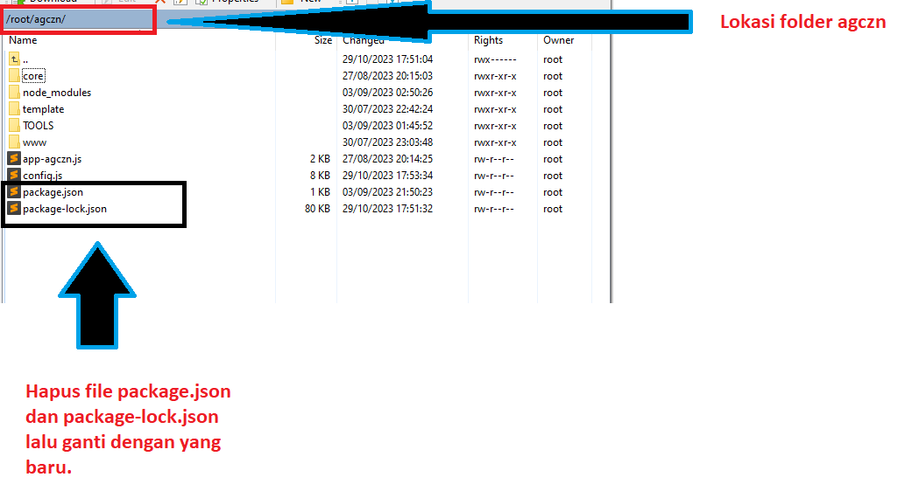

# agczn-after-migration
Konfigurasi agczn setelah migrasi database.

# Harap Perhatikan
Panduan terdiri dari 2 jenis, yaitu :
1. Panduan untuk pengguna yang sebelumnya telah mnenjalankan script agczn.
2. Panduan untuk pengguna baru yang sebelumnya belum pernah menjalankan script.

# A. Panduan untuk pengguna yang sebelumnya TELAH MENJALANKAN script agczn

1. Silahkan download repository. [DOWNLOAD](https://github.com/maskodingku/agczn-after-migration/archive/refs/heads/main.zip)
2. Silahkan unzip, Di dalamnya terdapat file penting yaitu :  `database.js`, `package-lock.json` dan `package.json`.
3. 3 file ini akan kita pindahkan.
4. Untuk file `database.js`, silahkan pindahkan ke directory `core`. Silahkan hapus file `database.js yang lama`. Lihat gambar berikut :
   
   
5. Untuk file `package-lock.json` dan `package.json` silahkan pindahkan ke folder `agczn`. Silahkan hapus file `package-lock.json dan package.json yang lama`. Lihat gambar berikut :

   
6. Selanjutnya silahkan jalankan code update.
   
   `apt install build-essential -y`
   
8. Pastikan kamu telah melakukan `cd` ke lokasi directory 'agczn'. Lalu lakukan install npm.

   `npm install`

9. Selanjutnya silahkan buka file `config.js`. Lalu fokus pada semua code berikut :

   `"endpoint":"m8b7.ldn.idrivee2-16.com"`

   Ingat ya, ganti semua code ini, setidaknya ada 22 baris code seperti ini dan harus diganti.

10. Ganti `m8b7.ldn.idrivee2-16.com` dengan `agczn.my.id`, sehingga menjadi :

      `"endpoint":"agczn.my.id"`

11. Selanjutnya buka file `app-agczn.js` yang terdapat pada folder `agczn`.
12. Cari code berikut :

      `await database.init(config.database);`

13. lalu ganti dengan kode berikut :

      `await database.init(config.database,server,app);`

14. Jangan lupa save.
15. Selanjutnya lakukan restart pm2.

    `pm2 restart all` atau `pm2 restart app-agczn`

16. Done, silahkan akses web kamu.
17. Jika ada kendala silahkan kontak admin.

# B. Panduan untuk pengguna baru yang sebelumnya BELUM PERNAH MENJALANKAN script agczn

1. Untuk Pengguna baru silahkan download file scriptnya pada postingan ini GROUP FB PRIVATE AGCZN. [KLIK DISINI](https://www.facebook.com/groups/1652997401888494/posts/1670928436762057)
2. Lalu ikuti panduan instalasi. [KLIK DISINI](https://docs.google.com/document/d/1GKRW-F14emZ8E-oYGL_HqPTqED-QmIgto2XWxGPR0As/edit?usp=sharing)
