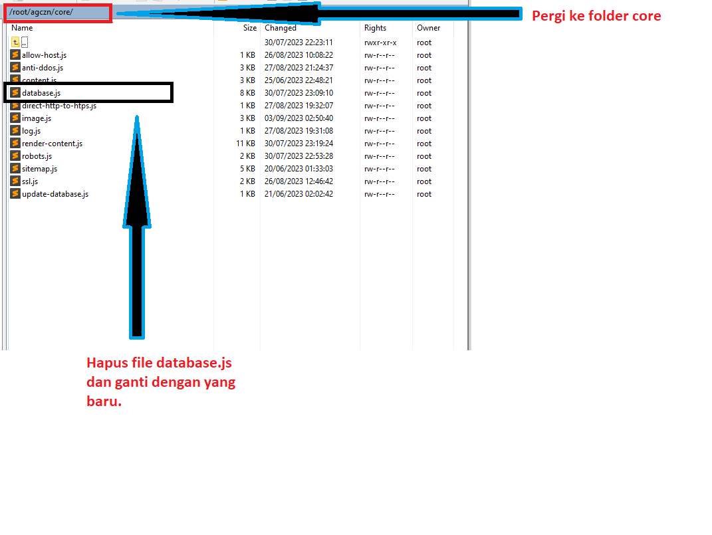

# agczn-after-migration
Konfigurasi agczn setelah migrasi database.

# Harap Perhatikan
Panduan terdiri dari 2 jenis, yaitu :
1. Panduan untuk pengguna yang sebelumnya telah mnenjalankan script agczn.
2. Panduan untuk pengguna baru yang sebelumnya belum pernah menjalankan script.

# A. Panduan untuk pengguna yang sebelumnya TELAH MENJALANKAN script agczn

1. Silahkan download repository. [DOWNLOAD](https://github.com/maskodingku/agczn-after-migration/archive/refs/heads/main.zip)
2. Silahkan unzip, Di dalamnya terdapat file penting yaitu :  `database.js`, `package-lock.json` dan `package.json`.
3. 3 file ini akan kita pindahkan.
4. Untuk file `database.js`, silahkan pindahkan ke directory `core`. Silahkan hapus file `database.js yang lama`. Lihat gambar berikut :
   
   
5. Untuk file `package-lock.json` dan `package.json` silahkan pindahkan ke folder `agczn`. Silahkan hapus file `package-lock.json dan package.json yang lama`. Lihat gambar berikut :

   
6.

# B. Panduan untuk pengguna baru yang sebelumnya BELUM PERNAH MENJALANKAN script agczn
